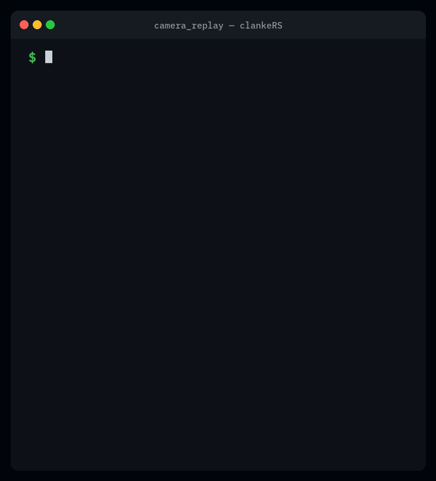

# clankeRS

<p align="center">
  <a href="https://crates.io/crates/clankers"></a>
  <a href="https://docs.rs/clankers"></a>
  <a href="LICENSE"></a>
</p>

**Train in PyTorch. Deploy in Rust. Replay-test against real robot logs.**

clankeRS is a Rust SDK for robotics teams on ROS 2 and PyTorch. The goal is memory-safe robot nodes, ONNX inference in Rust, MCAP-based replay testing, and a CLI that ties the workflow together.

> **Honest scope today:** Pub/sub in the workspace examples uses an **in-memory simulated bus** (no ROS 2 / DDS install required). Real `rclrs`/DDS integration is verified against ROS 2 Humble and ships as checked-in colcon packages under [`ros2/`](ros2/) with a one-command build — it builds **only inside a colcon workspace**, not from the plain `cargo build` (see the status table below). Latency numbers depend on your machine and model size — treat benchmarks as local measurements, not production guarantees.

<p align="center">
  
</p>

<p align="center"><sub>Recorded from <code>cargo run --release -p clankers --example camera_replay</code> on a sample MCAP log.</sub></p>

## Quick start

**Requirements:** Rust stable, network on first build (ONNX Runtime binary is downloaded automatically).

The whole workspace is published on [crates.io](https://crates.io/crates/clankers), so you can use clankeRS without cloning the repo:

```bash
# Add the SDK to your own project
cargo add clankers

# Install the CLI as `clankers`
cargo install clankers-cli
clankers new hello_clanker --template basic-node
cd hello_clanker
clankers run
```

Or clone the repo to build everything and run the bundled demo (sample data included):

```bash
git clone https://github.com/PvRao-29/clankeRS.git
cd clankeRS
cargo build --workspace

# Golden-path demo (MCAP → preprocess → ONNX → detections → sim pub/sub)
cargo run --release -p clankers --example camera_replay

# The CLI can also be installed straight from the checkout
cargo install --path crates/clankers-cli
```

## What works today

These paths are exercised in CI (`.github/workflows/ci.yml`) from a fresh clone with `cargo` + network.

| Area | How to try it | Notes |
|------|---------------|-------|
| Workspace build | `cargo build --workspace` | |
| CLI | `cargo run -p clankers-cli -- --help` | Install with `cargo install clankers-cli` (or `--path crates/clankers-cli` from a checkout) |
| MCAP inspect | `clankers inspect sample_data/camera_log.mcap` | |
| MCAP replay (data only) | `clankers replay sample_data/camera_log.mcap` | Replays messages and reports stats; **does not** run your node or ONNX |
| MCAP latency stats | `clankers latency sample_data/camera_log.mcap` | |
| **Golden-path vertical slice** | `cargo run --release -p clankers --example camera_replay` | Full pipeline on sample data; same as `clankers demo camera-perception` |
| ONNX inference node | `cargo run -p camera_perception_node` | 10 synthetic camera frames on the sim bus; uses `sample_data/models/detector.onnx` when present |
| Model validation | see below | Compares Rust ONNX output to a **pre-recorded** PyTorch reference |
| Image preprocessing | `clankers_tensor::ImageTensor` | Resize, ImageNet normalize, NCHW |
| Replay-test macro | `#[clankers::replay_test("…")]` | See [docs/testing.md](docs/testing.md) |
| Project templates | `clankers new <name> --template basic-node` | Also: `perception-node`, `ml-inference-node`, `replay-test-node` |

### Still rough / not done yet

| Area | Status |
|------|--------|
| Real ROS 2 (DDS) via `rclrs` | Backend **compiled and run against ROS 2 Humble** (in `.devcontainer`, arm64): `ImageMsg` verified as real `sensor_msgs/msg/Image` via `ros2 topic echo`; `DetectionArray` on `std_msgs/String` JSON. Now shipped as **checked-in colcon packages** under [`ros2/`](ros2/) with a one-command build (`scripts/setup_ros2_ws.sh`). Builds **only inside a colcon `ros2_ws/`** (message crates are yanked on crates.io; `rclrs` needs the git source), never from the plain `cargo build` — see [docs/ros2_integration.md](docs/ros2_integration.md) |
| `clankers record` | Stub — prints a hint; MCAP recording from `clankers run` is incomplete |
| `clankers visualize` | Prints MCAP summary + Foxglove/Rerun pointers; no live bridge |
| Live PyTorch at validate time | Not implemented — validation uses committed `expected_output.json` files |
| LibTorch / ExecuTorch backends | Planned |
| Production-hardened APIs | v1.0 goal — public APIs may change |

See [docs/roadmap.md](docs/roadmap.md) for the full roadmap.

## Golden path

The workflow clankeRS is building toward:

```text
PyTorch model → ONNX export → reference outputs → Rust ONNX inference → MCAP replay test
```

**Try it now** (one command, sample data included):

```bash
cargo run --release -p clankers --example camera_replay
```

This reads `sample_data/camera_log.mcap` and `sample_data/models/detector.onnx`, runs preprocess → ONNX → detections, publishes on a **simulated** `/detections` topic, and prints measured latency. Example output (numbers vary by machine):

```text
Loading detector.onnx...
Opening camera_log.mcap...
Running replay...

Frame 200/200

Published 200 detections to /detections
Replay complete.

Replay Summary
  Frames:    200
  FPS:       …
  Detections received on /detections: 200
  Dropped:   0

Latency:
  p50: …
  p95: …
  p99: …

✓ Replay passed
```

The FPS/latency figures measure the in-process pipeline (decode → preprocess → ONNX → sim publish). They do **not** include real camera I/O, network DDS, or robot hardware.

## Model validation

`validate-model` checks that Rust ONNX Runtime output matches a **stored PyTorch reference** (`expected_output.json`) for a fixed sample input. PyTorch is **not** required at validation time — references are generated offline (see below).

```bash
cargo run -p clankers-cli -- validate-model \
  --onnx sample_data/models/detector.onnx \
  --samples sample_data/detector_inputs
```

Example output:

```text
Model compatibility: passed

PyTorch output shape:     [1, 6]
Rust ONNX output shape:   [1, 6]

Max absolute error:       …
Mean absolute error:      …
Tolerance:                0.001000

Rust latency p50:         … ms

Status: safe to deploy
```

The `safe to deploy` line means **numerical agreement on the bundled sample inputs** within tolerance — not a full production sign-off. For your own models, regenerate references and tighten tolerance as needed. Live `--pytorch` / `--checkpoint` comparison flags are reserved for a future release.

Policy model (default samples dir):

```bash
cargo run -p clankers-cli -- validate-model --onnx sample_data/models/policy.onnx
```

## Regenerating sample models

Sample ONNX models and PyTorch reference outputs live under `sample_data/` and are checked into the repo:

```bash
pip install torch onnx
python3 scripts/make_sample_models.py
```

This exports two small deterministic PyTorch models to ONNX and writes `expected_output.json` for `validate-model`.

## Crates

All crates are published on crates.io under the `0.1.0` release. Most users only need the top-level [`clankers`](https://crates.io/crates/clankers) facade (or the `clankers-cli` binary); the rest are re-exported through it.

| Crate | crates.io | docs.rs | Purpose |
|-------|-----------|---------|---------|
| [`clankers`](https://crates.io/crates/clankers) | [](https://crates.io/crates/clankers) | [docs](https://docs.rs/clankers) | Umbrella SDK facade — start here |
| [`clankers-cli`](https://crates.io/crates/clankers-cli) | [](https://crates.io/crates/clankers-cli) | [docs](https://docs.rs/clankers-cli) | `clankers` command-line tool |
| [`clankers-core`](https://crates.io/crates/clankers-core) | [](https://crates.io/crates/clankers-core) | [docs](https://docs.rs/clankers-core) | Core primitives and types |
| [`clankers-ros2`](https://crates.io/crates/clankers-ros2) | [](https://crates.io/crates/clankers-ros2) | [docs](https://docs.rs/clankers-ros2) | ROS-free core: sim backend + message/QoS types |
| [`clankers-data`](https://crates.io/crates/clankers-data) | [](https://crates.io/crates/clankers-data) | [docs](https://docs.rs/clankers-data) | MCAP logging, replay, inspection |
| [`clankers-ml`](https://crates.io/crates/clankers-ml) | [](https://crates.io/crates/clankers-ml) | [docs](https://docs.rs/clankers-ml) | ONNX inference and model deployment |
| [`clankers-tensor`](https://crates.io/crates/clankers-tensor) | [](https://crates.io/crates/clankers-tensor) | [docs](https://docs.rs/clankers-tensor) | Robotics-focused tensor utilities |
| [`clankers-geometry`](https://crates.io/crates/clankers-geometry) | [](https://crates.io/crates/clankers-geometry) | [docs](https://docs.rs/clankers-geometry) | Math, transforms, and frames |
| [`clankers-runtime`](https://crates.io/crates/clankers-runtime) | [](https://crates.io/crates/clankers-runtime) | [docs](https://docs.rs/clankers-runtime) | Execution, scheduling, observability |
| [`clankers-testing`](https://crates.io/crates/clankers-testing) | [](https://crates.io/crates/clankers-testing) | [docs](https://docs.rs/clankers-testing) | Replay-based testing tools |
| [`clankers-macros`](https://crates.io/crates/clankers-macros) | [](https://crates.io/crates/clankers-macros) | [docs](https://docs.rs/clankers-macros) | Proc macros for nodes and replay tests |

> The real `rclrs`/DDS packages under [`ros2/`](ros2/) are **not** published to crates.io — they build only inside a colcon workspace (see [docs/ros2_integration.md](docs/ros2_integration.md)).

## Documentation

- [Getting started](docs/getting_started.md)
- [Installation](docs/installation.md)
- [ROS 2 integration](docs/ros2_integration.md) — sim bus + real rclrs/DDS colcon packages ([`ros2/`](ros2/))
- [PyTorch to ONNX](docs/pytorch_to_onnx.md)
- [Model validation](docs/model_validation.md)
- [MCAP replay](docs/mcap_replay.md)
- [Testing](docs/testing.md)
- [Architecture](docs/architecture.md)

## License

MIT — see [LICENSE](LICENSE).
